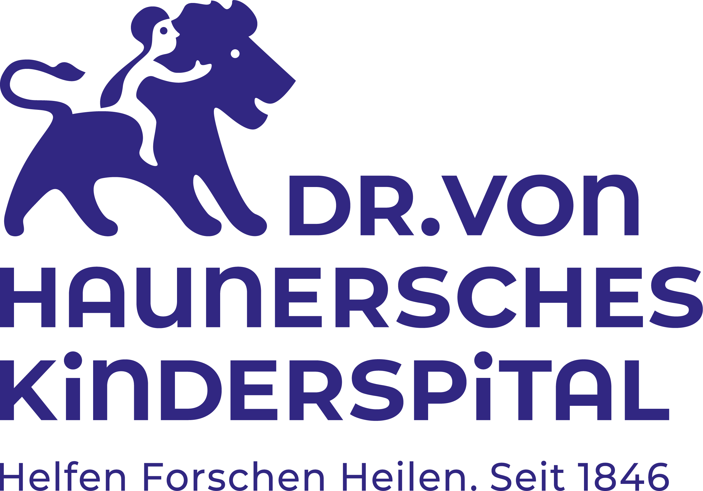
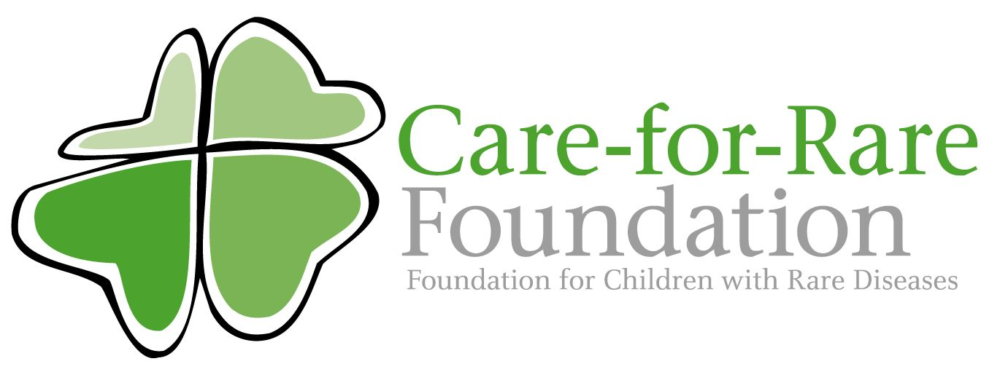
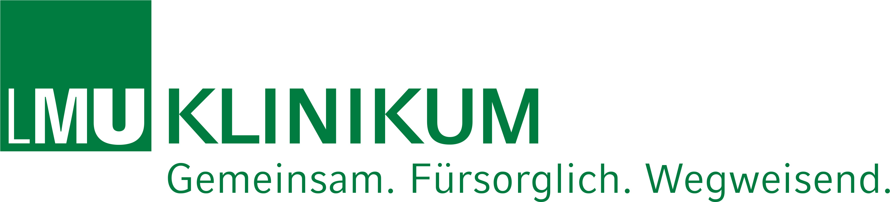
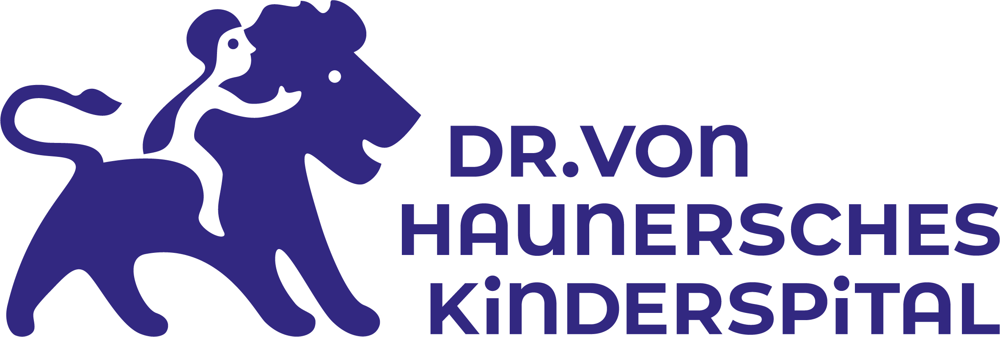
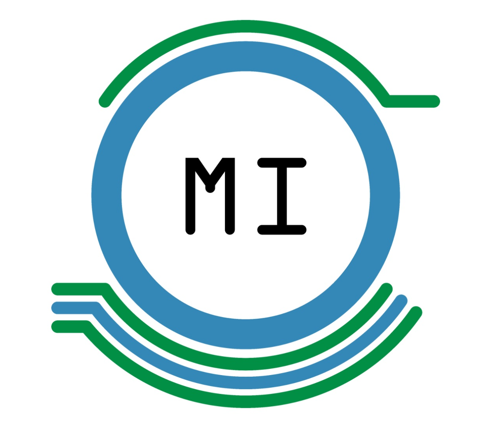
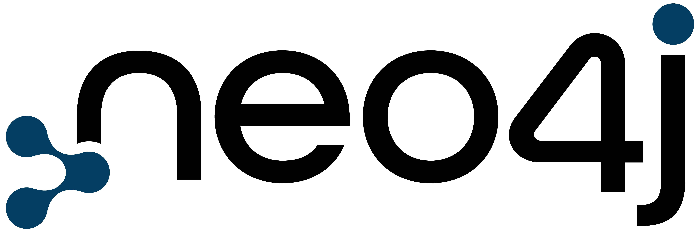

{}

<h1 class="-text-white display-5 fw-bold m-0">AMIGO: We care for rare.</h1>

Welcome to Project “AMIGO: <strong>A</strong>dvanced <strong>M</strong>edical <strong>I</strong>ntelligence for <strong>G</strong>uiding <strong>O</strong>mics-based  Medicine”.

Come to our booth at IHI!

Contact: Nicola.Goetzenberger@med.uni-muenchen.de

Our project, launched and managed by Dr. von Hauner Children’s Hospital in Munich, Germany, aims to give hope to children with rare diseases, known as the orphans of medicine. By integrating Machine Learning (ML) and following a decentralized approach, it will be possible to analyze and link children’s clinical and genetic data with the highest level of data security. The knowledge gained will be used to train an AI and thus help doctors around the world to diagnose and treat patients in an individual and personalized way.

<h3 class="card-title">Clinics</h3>

<i class="fa-regular fa-hospital fa-2xl"></i>

We bring cutting-edge technology to clinics, enabling creation of collaborative AI applications without any data sharing.

<a href="./docs/clinics" class="btn btn-light">Read more</a>

<h3 class="card-title">Developers</h3>

<i class="fa-regular fa-code fa-2xl"></i>

Using knowledge graphs we provide you with curated and preprocessed datasets so you can focus on building machine learning solutions.

<a href="./docs/developers/" class="btn btn-light">Read more</a>

<h3 class="card-title">Families</h3>

<i class="fa-regular fa-people-roof fa-2xl"></i>

Helping our patients and their families is the heart of our initiative. That is why our partners at Dr. von Hauner Children’s Hospital are working on SCIVIAS study and early diagnosis of rare diseases.

<a href="./docs/families" class="btn btn-light">Read more</a>

{}

{}

<h2>Dr. von Hauner Children’s Hospital</h2>

Dr. von Hauner Children’s Hospital is the Pediatric Clinic of the University Hospital of the Ludwig Maximilian University of Munich. It is a reference center for many children with severe, chronic or complex diseases. In addition to inpatient and outpatient treatment, everyday life is characterized by science and research.

Driven by the passion to improve clinical care for children with rare and common diseases, interdisciplinary research teams collaborate on a variety of themes centered on pediatric health issues. The focus is on studying biological factors governing child development as well as on designing innovative therapeutic strategies.

At Dr. von Hauner, one follows the believe that children also have a right to participate in medical progress. Therefore, the clinic, its physicians and medical staff work closely together with the patients and their families. The aim is to understand the basics of diseases to derive new ways of diagnosis, treatment and prevention.

Personalized, predictive and participatory precision medicine is the primary goal of the actions taken.

{}

{}

<h2>AMIGO</h2>

<strong>A</strong>dvanced <strong>M</strong>edical <strong>I</strong>ntelligence for <strong>G</strong>uiding <strong>O</strong>mics-based Medicine

Join us in integrating the potential of Artificial Intelligence into the healthcare sector. Project AMIGO is committed to applying federated machine learning and clinical knowledge graphs, so that children with rare diseases can receive a rapid diagnosis and targeted treatment.

**Just because it is called _rare_, doesn’t mean it doesn’t affect us all.**

<a href="./docs/developers/amigo" class="btn btn-light">Join IHI <i class="fa-solid fa-arrow-right"></i></a>

<h3>Joint initiative of</h3>

{}

{}

<h2>What is the&nbsp;

<h2 class="-text-white fw-bold m-0">Care for Rare</h2>

&nbsp;foundation?
</h2>

The Care-for-Rare Foundation is helping children with rare diseases. Children with rare diseases are the
orphans of medicine. They are overshadwed in many ways: Odysseys from doctor to doctor and frequent
misdiagnoses define their lives. Many rare diseases are still incurable. Only through increased research
efforts and international cooperation can this fate be changed. 

The Care-for-Rare Foundation helps across national borders to give children with rare diseases hope for a
cure – regardless of their origin or financial means. It bases its commitment on the guiding principle
of “recognize – understand – cure”.

<h3>Actions taken:</h3>
<ul class="list-group list-group-flush pb-3">
<li class="list-group-item"><i class="fa-regular fa-circle-check pe-2" style="color: #00883A"></i>Promoting development of new therapies</li>
<li class="list-group-item"><i class="fa-regular fa-circle-check pe-2"  style="color: #00883A"></i>Financing the further training of doctors and scientists</li>
<li class="list-group-item"><i class="fa-regular fa-circle-check pe-2"  style="color: #00883A"></i>Raising awareness of rare diseases</li>
<li class="list-group-item"><i class="fa-regular fa-circle-check pe-2"  style="color: #00883A"></i>Helps in individual cases through clinical treatment</li>
</ul>

The starting point for these activities is the Care-for-Rare Center at the Dr. von Hauner Children's Hospital of the Ludwig Maximilian University in Munich.

{}

{}

  <h2>Frequently Asked Questions (FAQ)</h2>
  

    

      <h2 class="accordion-header" id="headingOne">
        <button
          class="accordion-button"
          type="button"
          data-bs-toggle="collapse"
          data-bs-target="#collapseOne"
          aria-expanded="true"
          aria-controls="collapseOne"
        >
          What does AMIGO aim for? ​
        </button>
      </h2>
      

        

          AMIGO aims to ensure the evolution from paediatric immunological diseases to general adult care. And therefore, paving the way to personalized medicine.​
        

      

    

    

      <h2 class="accordion-header" id="headingTwo">
        <button
          class="accordion-button collapsed"
          type="button"
          data-bs-toggle="collapse"
          data-bs-target="#collapseTwo"
          aria-expanded="false"
          aria-controls="collapseTwo"
        >
          What makes AMIGO unique?
        </button>
      </h2>
      

        

          Project AMIGO is the first project, in which leading European Children’s Hospitals are joining forces to push progress further.​ So far, we can provide access to precious multi-omics data of >10.000 European patients. As we collect cross-sectional, and longitudinal data, this number is expected to grow fast.​ The data we gather never leaves the on-premise site. This is how we ensure that there is no violation of data protection.​ Technological Independence: It can work with any software that uses federated machine learning is not depending on the system of the clinic.​
        

      

    

    

      <h2 class="accordion-header" id="headingThree">
        <button
          class="accordion-button collapsed"
          type="button"
          data-bs-toggle="collapse"
          data-bs-target="#collapseThree"
          aria-expanded="false"
          aria-controls="collapseThree"
        >
          What is the Outcome of AMIGO?
        </button>
      </h2>
      

        

          An innovative, self-sustaining ecosystem will empower target identification and validation via multi-omics analysis in immunological disorders.​ European Union’s health industry will be strengthened to  become competitive on a global level by collecting and using European patient data.
        

      

    

    

      <h2 class="accordion-header" id="headingFour">
        <button
          class="accordion-button collapsed"
          type="button"
          data-bs-toggle="collapse"
          data-bs-target="#collapseFour"
          aria-expanded="false"
          aria-controls="collapseFour"
        >
          What’s next?
        </button>
      </h2>
      

        

          Currently, we are aiming to build a consortium for <a href="./docs/developers/amigo" class="btn btn-light">IHI Call 9</a>​.
          For steeper progress we need: Experts in target-to-drug Development, Brilliant minds in Data-to-AI Development and Clinical Trial Support.​ Contact us if you want to get involved!​
        

      

    

  

{}

