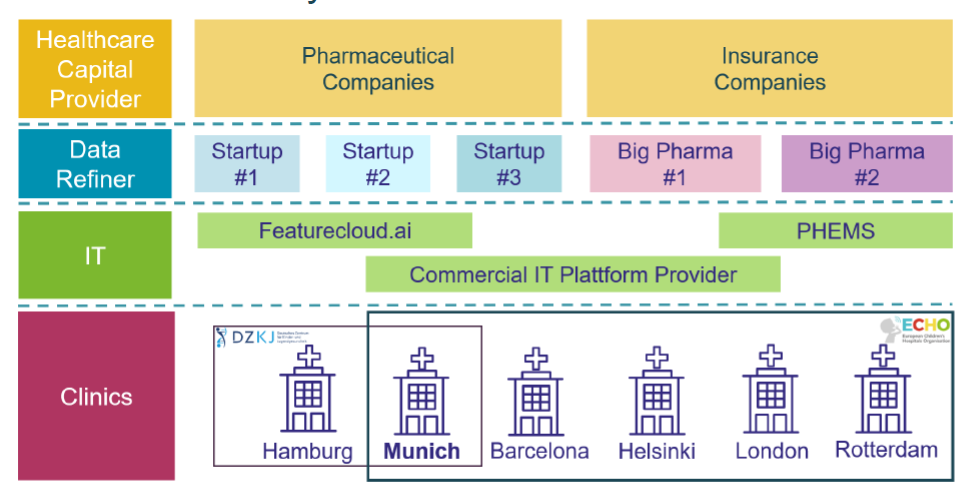

Pediatric clinics face major challenges with rare diseases due to their complexity, limited research, and lack of treatment protocols. Diagnosing these conditions can take years, involving specialists, genetic testing, and inconclusive results — delaying care and distressing families. Clinics often rely on experimental or off-label treatments, adding further uncertainty. The ECHO (European Children’s Hospitals Organization) helps tackle these issues by sharing expertise, resources, and best practices across borders. This collaboration speeds up diagnoses, boosts research, saves costs, and improves clinical trial feasibility. Families benefit from faster, more accurate care, easing both emotional and financial burdens.

  

