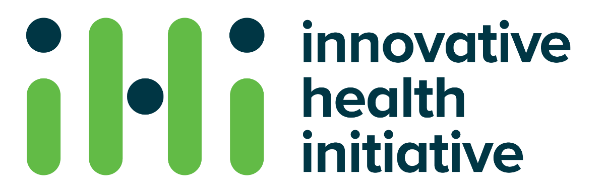

  <h2 class="me-3">IHI Call 9</h2>
  

### Contact

Prof. Dr.Christoph Klein   
Dr.von Hauner Children’s Hospital Munich, Germany  
christoph.klein@med.uni-muenchen.de

Nicola Götzenberger   
Global Liaison Manager  
Dr.von Hauner Children’s Hospital Munich, Germany  
Nicola.Goetzenberger@med.uni-muenchen.de

Further Information on Brokerage Platform:​   
<a href="https://ihicalldays2024.converve.io/index.php?page=cat_tech">AMIGO Proposal Link​</a>  
<a href="https://ihicalldays2024.converve.io/index.php?page=meet_request_meetings&action=detail&params%5Bq%5D=Christoph+Klein&params%5Bshow%5D=pers&params%5Bevent_id%5D=1&params%5Bid%5D=408&params%5Bpers_id%5D=419">Christoph Klein Profile Link​</a>

## Is your project suitable for IHI?
### Public Private Partnerships are essential: 

- To **provide access** to hospital-based databases
- To **secure continuous expansion** of databases​
- To **enable cutting-edge analysis** of data​
- To **empower a journey of investigation** leading to precision medicine for children and adults with rare and common immunological diseases​

### Contribution through collaboration
- **Real time access** allows development in-time​
- **Early involvement and access** secures targeted project progress​
- **New marketing strategies** will be established

### Outcomes and Impacts
#### Innovative ecosystem

Ensure evolution from pediatric immunological diseases to general adult care -paving the way to personalized medicine​

- Access to precious **multi-omics data (of > 10.000 European patients)​**
- **Technological Independence​**
- Joint forces of **leading European Children’s Hospitals**

**Innovative ecosystem** will empower **target identification and validation** via multi-omics analysis in immunological disorders.​

**European Union’s health industry** will be strengthened to become competitive on a global level by collecting and using **European patient data**.​

**Patients** will benefit by collaboration, gradual roll-out, and design of novel diagnostic methods and therapeutic strategies establishing personalized medicine.​

### Expertise and Resources
We offer:​
- Leading European scientists in Immune Disorders​
- Network of European Children‘s Hospitals (ECHO)​
- Access to >10.000 Patient Data​

We need:​
- Target-to-Drug Expertise​
- Data-to-AI Expertise​
- Clinical Trial Support​

<h3>Joint initiative of</h3>
{}
{}