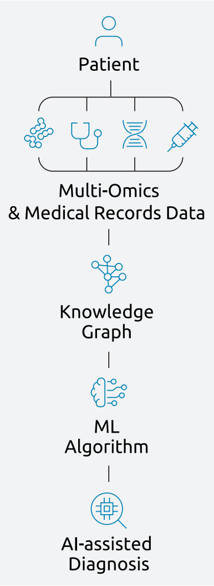

{}
{}

## Challenge

We invite you to develop machine learning (ML) algorithms that can use knowledge graph data and accomplish these points:​

**A.** Accurately predict if a child is healthy or is diagnosed with an illness.​

**B.** Accurately predict patients’ disease category based on the first letter of ICD-10 code system.​

**C.** Correctly Cluster patients based on the features from the omics and clinical data.​

**D.** Offer the capability to be executed federatively using the feature cloud functionality.​

### Business Outcome

- Outline how the approach can be implemented and scaled to improve patients’ lives.​

### Technical Architecture

- You are free to use the synthetic data made available for you on Neo4j data base
- You will be able to connect to the Feature Cloud platform and upload your models
- You are free to use both supervised and unsupervised methods.

{}
Technical Architecture
{}

<figure class="card rounded p-2 td-post-card mb-0 mt-0" style="max-width: 190px">

</figure>

## Background

- The disease experts at the Dr. von Hauner Children’s Hospital in Munich are working toward establishing an AI platform to improve diagnosis of rare diseases in children. ​
- Their goal is to implement federated learning and create a library of ML models to assist clinicians with patients' diagnosis.​

- To protect patients’ privacy, we have already preprocessed and analyzed the data and created knowledge graphs which you can use to build your algorithm. ​

- The knowledge graph data comprise thousands of human phenotype ontology (HPO) features, covering genomic, proteomic, blood values, electronic health records and patient questionnaires.​

- Additionally, we provide you with a well-crafted unlabeled synthetic data set that closely resembles the structure of the real data.​

Joint initiative of
{}
{}